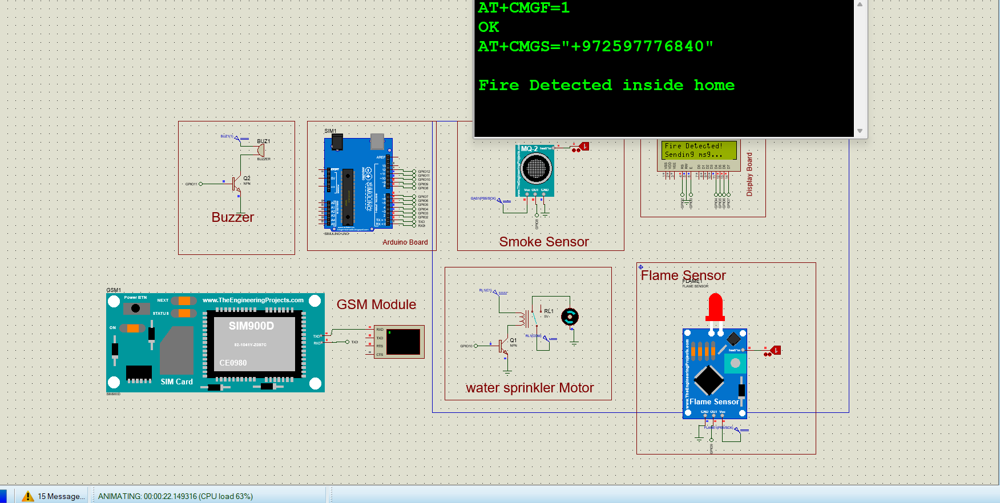
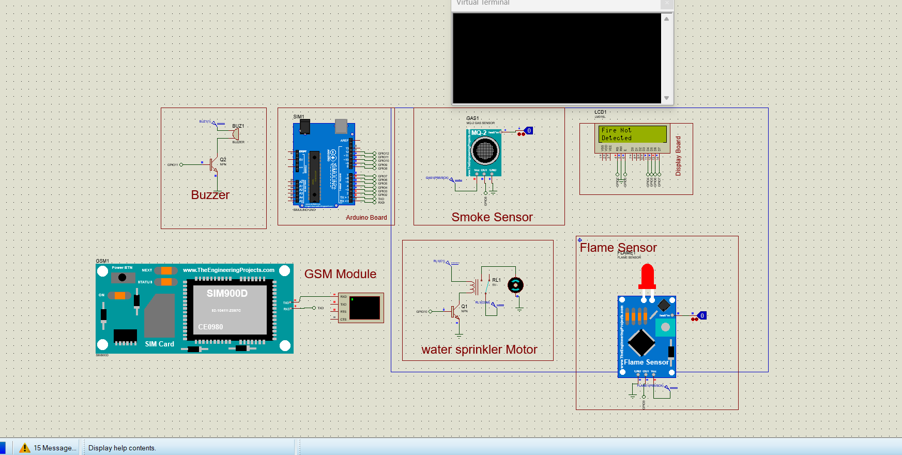
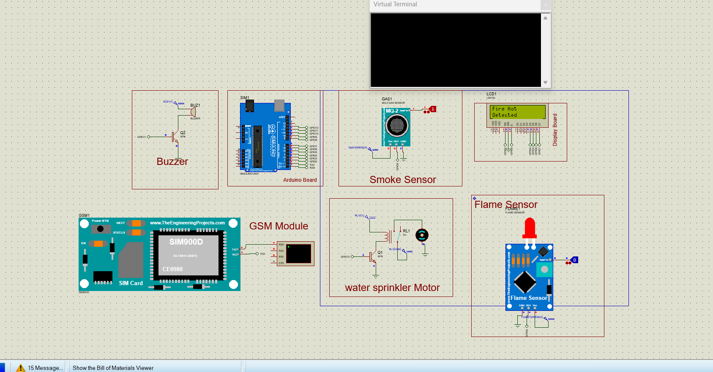
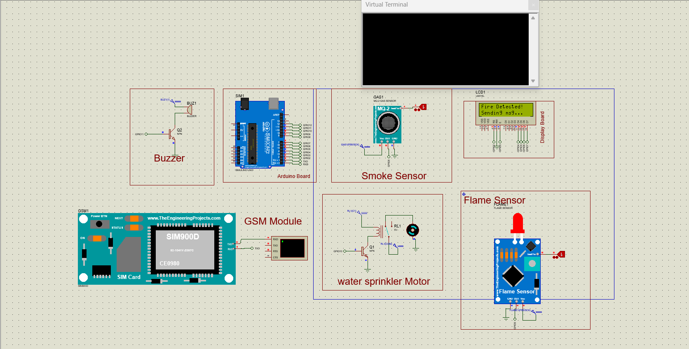
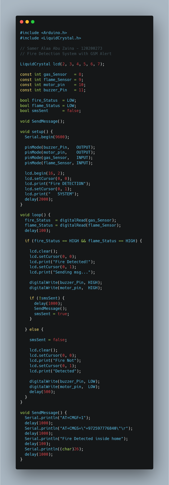

# GSM-Based Fire Detection and Alert System

## Overview

This project presents a **Smart Fire Detection and Alert System** developed using an **Arduino Uno**, **MQ-2 Gas Sensor**, **Flame Sensor**, **SIM900D GSM Module**, **16x2 LCD Display**, **Buzzer Alarm**, and an **Automatic Water Sprinkler Motor**.

The system continuously monitors the environment for fire hazards. A fire condition is confirmed only when both the gas sensor and flame sensor detect danger simultaneously. Once a fire is detected, the system automatically:

- Activates an audible alarm (Buzzer).
- Starts the water sprinkler motor.
- Displays a warning message on the LCD.
- Sends an SMS alert to a predefined phone number using the GSM module.

The project was designed, simulated, and tested using **Proteus Design Suite**.

---

## Features

- 🔥 Flame Detection
- 💨 Smoke/Gas Detection
- 📱 GSM SMS Notification
- 🚨 Buzzer Alarm
- 💧 Automatic Water Sprinkler Activation
- 📟 LCD Status Display
- 🖥️ Proteus Simulation
- ⚡ Real-Time Fire Monitoring

---

## Hardware Components

- Arduino Uno
- SIM900D GSM Module
- MQ-2 Gas Sensor
- Flame Sensor Module
- 16x2 LCD Display (LM016L)
- Buzzer
- Water Sprinkler Motor
- Relay Driver Circuit
- NPN Transistor
- Power Supply

---

## System Architecture

The system consists of the following modules:

1. **Gas Detection Module (MQ-2 Sensor)**
2. **Flame Detection Module**
3. **Arduino Control Unit**
4. **GSM Communication Module**
5. **Alarm Unit (Buzzer)**
6. **Water Sprinkler Motor**
7. **LCD Display Unit**

When both sensors detect a fire condition, Arduino triggers the alarm, activates the sprinkler motor, updates the LCD display, and sends an SMS notification.

---

## Pin Configuration

| Component             | Arduino Pin |
| --------------------- | ----------- |
| LCD RS                | 2           |
| LCD EN                | 3           |
| LCD D4                | 4           |
| LCD D5                | 5           |
| LCD D6                | 6           |
| LCD D7                | 7           |
| MQ-2 Gas Sensor       | 8           |
| Flame Sensor          | 9           |
| Water Sprinkler Motor | 10          |
| Buzzer                | 11          |

---

## System Logic

### Normal State

When no fire is detected:

```text
Fire Not
Detected
```

System Status:

- Buzzer OFF
- Sprinkler OFF
- SMS Not Sent

---

### Fire Detection State

A fire condition is detected when:

```cpp
gas_sensor == HIGH &&
flame_sensor == HIGH
```

The system then:

1. Activates the buzzer.
2. Starts the water sprinkler motor.
3. Displays a fire warning message.
4. Sends an SMS alert.

LCD Output:

```text
Fire Detected!
Sending msg...
```

---

## SMS Alert Functionality

The system communicates with the SIM900D GSM module using standard AT commands.

### Commands Sent

```text
AT+CMGF=1
AT+CMGS="+972597776840"
```

### SMS Content

```text
Fire Detected inside home
```

---

## Source Code

Main Arduino source file:

```text
Arduino/Fire_Detection_System_Proteus.ino
```

---

## Proteus Files

Simulation files:

```text
Proteus/Fire_Detection_Alaram_System.pdsprj
Proteus/FireDetection.hex
```

---

# Project Screenshots

## System Overview



---

## Normal Operating Mode



---

## Single Sensor Triggered

In this state only one sensor is activated, therefore no fire alarm is generated.



---

## Fire Detection Mode

When both sensors detect danger, the system activates the alarm and sends an SMS notification.



---

## Fire Detection (Detailed View)


---

## Full Source Code Snapshot



---

## Demonstration Video

A complete explanation and demonstration of the project is available at:

https://www.youtube.com/watch?v=LGJyuIC3oNA

---

## Additional Resources

The following project resources are available through Google Drive:

- Project Report
- PowerPoint Presentation
- Required Libraries
- Additional Project Files

Google Drive Folder:

https://drive.google.com/drive/folders/16bkV9qrqVObnL1jc_onDpTdM4Wdtg_cR

---

## Libraries Used

```cpp
#include <Arduino.h>
#include <LiquidCrystal.h>
```

Any additional libraries required for the project can be downloaded from the Google Drive folder provided above.

---

## Future Improvements

- IoT-Based Monitoring System
- Mobile Application Integration
- Cloud Notification Services
- Temperature Sensor Integration
- Wi-Fi Connectivity
- Remote Monitoring Dashboard

---

# ✍️ Author

**Samer Alaa Abu Zaina**
Computer Engineer | Flutter Developer

Profiles Links:

[LinkedIn Profile](https://www.linkedin.com/in/samerabuzaina/) | [X Profile](https://x.com/SamerAbuZaina) | [Hackmd](https://hackmd.io/@wpo3bmzzTHevehZ2sWivjw?utm_source=overview&utm_medium=team-switcher)

---
